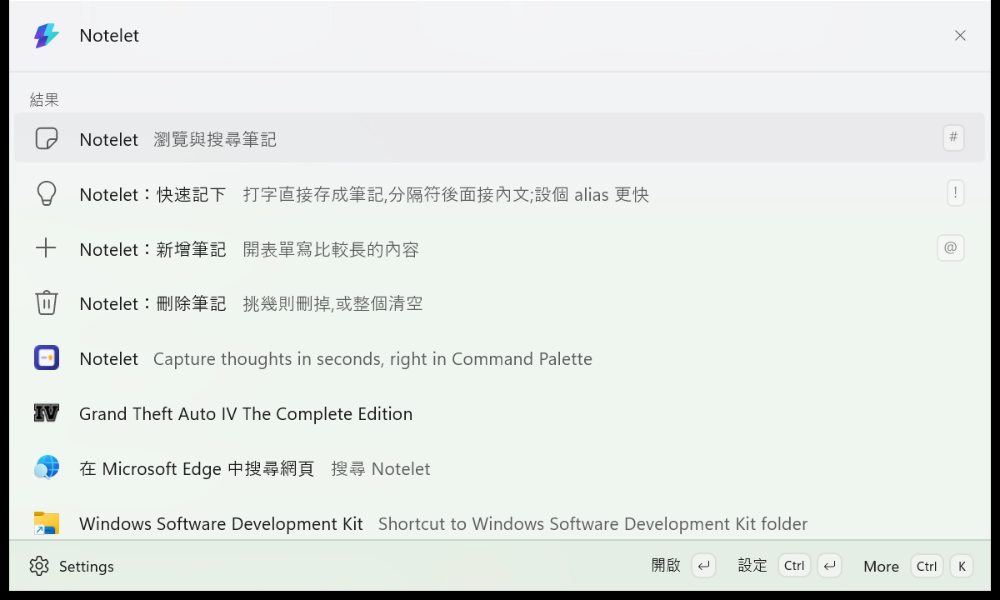
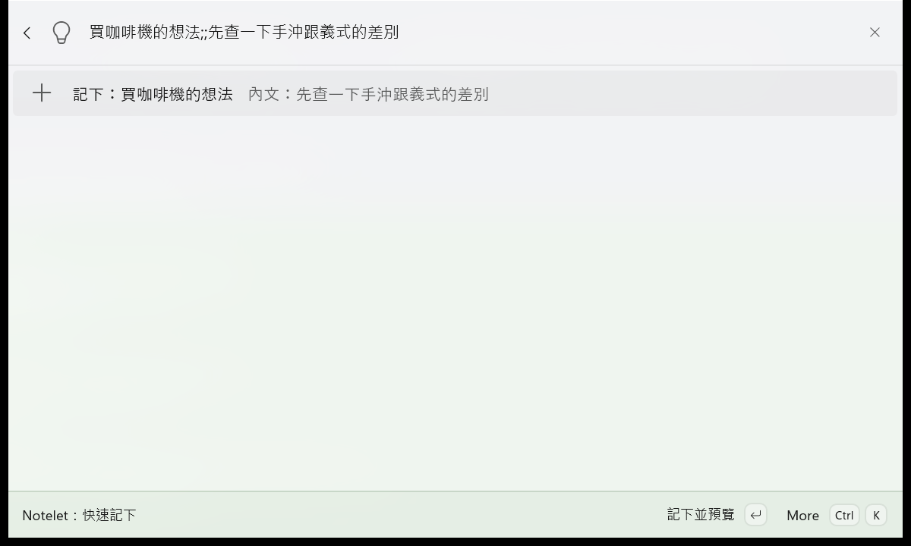
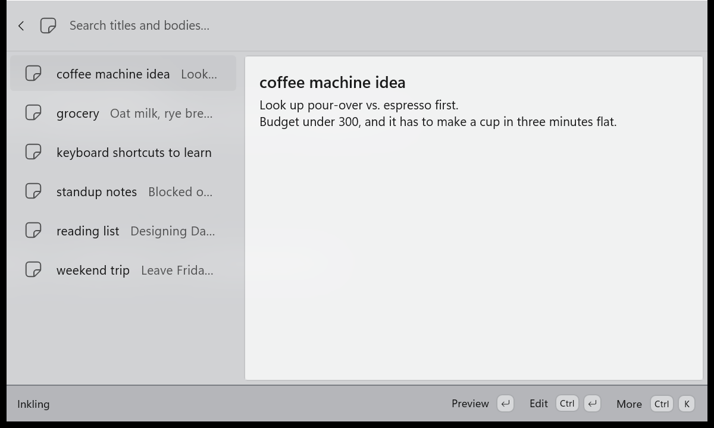

# Notelet

Capture a thought in seconds without leaving the keyboard: summon PowerToys Command Palette,
type, press Enter — the idea is saved as a plain Markdown file in a folder you choose.
Sync, mobile access, and editing come from whatever cloud drive and editor you already use;
Notelet itself contains zero sync code.

<!-- 上面這段英文是對外的 elevator pitch,日後直接拿去做 Store listing 與 gallery
     extension.json 的 shortDescription(另一處是 Package.appxmanifest 的 Description)。 -->





<!-- 截圖用 tools\cmdpal-ui.ps1 的 shot 動作在真機上拍(PrintWindow,見該腳本與
     .claude/skills/verify-cmdpal-ui)。重拍請照 docs/manual-test-checklist.md 的畫面重跑一次。 -->

叫出 Command Palette → 打 `n` 加一個空白 → 快速記下頁跳出來 →
打 `買咖啡機的想法` → Enter。存檔完成,全程不離開鍵盤。

> **`n` 是你自己設的 alias,裝好之後要先設**,上面那條路才成立:CmdPal 設定 →
> Extensions → Notelet → `Notelet：快速記下` → Alias 填 `n`。
> 中間那次跳頁不用手動觸發 —— 打完 `n` 空白它自己就跳,所以按鍵數跟一路打在
> 主搜尋框裡完全一樣。想更快就再給它一個全域快速鍵,連 `n` 都省了。

筆記是資料夾裡的純 Markdown 檔(YAML front matter + 內文),任何編輯器都能直接開。
多端同步交給雲端硬碟處理,Notelet 本身沒有任何同步程式碼。

## 功能

| | |
|---|---|
| 快速記下 | `Notelet：快速記下` 打字直接存檔;想連內文一起記就 `<標題>;;<內文>`(分隔符可以在設定裡換掉)。底下會列出標題相近的既有筆記,免得同一件事記兩遍。要貼多行內容時會多給一列「內文取自剪貼簿」,繞過單行搜尋框 |
| 記下後先看一眼 | 存好會停在筆記上,確認沒記錯再按一次 Enter 收起。預設開著,設定裡可以關掉 |
| 新增(完整) | `Notelet：新增筆記` 開表單,可寫多行內文 |
| 瀏覽與搜索 | 標題與內文都能搜,多個關鍵字是 AND,標題命中排前面;副標是內文的第一行摘要。搜不到時會直說「找不到符合的筆記」(而不是「還沒有任何筆記」),按 Enter 直接進快速記下 |
| Markdown 預覽 | 選中筆記按 Enter 看渲染結果 |
| 原始文字 | 清單頁按 `Ctrl+U`,詳細窗格在渲染與原始 Markdown 之間切換 |
| 編輯 | 表單式編輯(`Ctrl+E`),Tab 到「儲存」按 Enter;或用「在預設編輯器開啟」(`Ctrl+O`)跳出去改 |
| 複製內文 | `Ctrl+Shift+C` 把內文複製到剪貼簿,不含 front matter,**面板不會關掉** |
| 開啟檔案位置 | `Ctrl+L` 在檔案總管裡選中那個 `.md` |
| 刪除 | 清單頁 `Ctrl+D`,確認後**移到資源回收筒**(不是永久刪除) |
| 連續刪 | `Notelet：刪除筆記` 開一頁,`Enter` 刪除(先問一次),`Ctrl+Enter` 直接刪;不是 Notelet 建立的檔案兩條路都會問 |
| 清空 | 同一頁的「刪除全部」,**先列出會刪掉哪些檔案**,不是 Notelet 建立的排在最前面 |
| 介面語言 | 英文、繁體中文、簡體中文,跟著 Windows 的顯示語言走,沒有設定項 |

封存、tag 分類、置頂還沒做。`tags` 欄位讀得懂,但**沒有值就不會寫進檔案**(見〈資料格式〉)。

### 快速鍵

清單頁(`Notelet`)與預覽頁上,選中一則筆記之後:

| 鍵 | 做什麼 | 清單頁 | 預覽頁 |
|---|---|:-:|:-:|
| `Enter` | 打開預覽 | ✅ | — |
| `Ctrl+E` | 編輯(表單) | ✅ | ✅ |
| `Ctrl+U` | 詳細窗格切換渲染 / 原始 Markdown | ✅ | — |
| `Ctrl+Shift+C` | 複製內文 | ✅ | ✅ |
| `Ctrl+O` | 用系統預設的程式開啟 `.md` | ✅ | ✅ |
| `Ctrl+L` | 在檔案總管裡選中這個檔案 | ✅ | ✅ |
| `Ctrl+D` | 刪除(先跳確認框) | ✅ | — |
| `Ctrl+K` | 打開選單,上面每一項都寫著自己的鍵 | ✅ | ✅ |

「記下並預覽」那一頁(快速記下的 Enter 落點)用同一組手勢:`Ctrl+E` 編輯、
`Ctrl+Shift+C` 複製、`Ctrl+O` 在編輯器開啟 —— 三個頁面共用同一份命令組裝。
`Notelet：刪除筆記` 那一頁另有自己的兩個鍵:`Enter` 刪除(先問一次)、`Ctrl+Enter` 直接刪。

**只有複製帶 Shift**:`Ctrl+C` 是搜尋框自己的複製鍵,拿走就沒辦法複製剛打的字,
而 `Ctrl+Shift+C` 是 CmdPal 內建擴展的複製慣例。哪些字母不能碰、為什麼刪除是 `Ctrl+D`,
完整的挑鍵考證見[設計考證〈清單頁的快速鍵〉](docs/design-notes.md#list-shortcuts)與
`src/Notelet/Shortcuts.cs`。**CmdPal 目前不讓使用者改擴展的快速鍵**,
能改的只有頂層命令的 alias 與全域快速鍵。

## 需求

使用者(直接裝打包好的套件):

| | |
|---|---|
| Windows | 10.0.19041 以上 |
| Command Palette | 0.11 以上(獨立 MSIX 套件 `Microsoft.CommandPalette`) |

**不需要裝 .NET** —— 發佈的套件是 self-contained,執行期全部包在裡面。

從原始碼建置另外需要(不需要 Visual Studio,整套流程走 dotnet CLI):

| | |
|---|---|
| .NET SDK | 10.0 以上 |
| Developer Mode | 必須開啟。設定 → 系統 → 開發人員專用 |

## Build 與本機安裝

```powershell
git clone https://github.com/1morr/Notelet.git Notelet   # 換成你的實際位址
cd Notelet
.\tools\deploy.ps1 -Configuration Release
```

然後在 Command Palette 執行 **Reload**(要選副標題是 `Reload Command Palette extensions`
的那一個),CmdPal 才會重新載入擴展。

`deploy.ps1` 會依序做:build/publish → 以 loose file 註冊套件 → 查 Windows 的
AppExtension 目錄確認 CmdPal 真的看得到它(自動的,不必靠肉眼開 CmdPal)。
Core 層的行為測試是 `dotnet test`。

### Debug 與 Release 的差別

trimming 只在 `dotnet publish` 時生效,而 `Add-AppxPackage -Register` 註冊的是 build 佈局
—— 兩者不是同一份輸出,所以腳本對兩種組態走不同的路:

| | 做法 | 大小 | 用途 |
|---|---|---|---|
| `Debug` | 直接註冊 build 佈局 | ~106 MB | 開發。`Debug.WriteLine` 有作用,建置快 |
| `Release` | 先 publish(trimming 生效),再併入 build 產生的 `AppxManifest.xml` | ~30 MB | 日常使用 |

只跑 `dotnet publish -c Release` 而不做後面那步,註冊到的仍然是未 trim 的 build 佈局,
等於完全沒驗到 trimming 有沒有把東西砍壞。

**loose file 註冊會綁住路徑**:`Add-AppxPackage -Register` 不會複製檔案,Windows 直接引用
`src\Notelet\bin\` 底下那個佈局,所以**不要在部署後刪掉 `bin\`**(`git clean -xfd` 也會刪),
否則擴展會壞掉,真的刪了就重跑一次 `deploy.ps1`。

**移除**:`Get-AppxPackage -Name Notelet | Remove-AppxPackage`。

## 同步設定

Notelet **不做同步**。它只是把 Markdown 檔寫進你指定的資料夾,同步 100% 交給雲端硬碟
客戶端 —— 離線可用性、衝突處理、手機端存取全部沿用 OneDrive / Dropbox 既有的能力。

預設資料夾是 `%OneDrive%\Notelet`(找不到 OneDrive 就退回 `文件\Notelet`)。
要改路徑:Command Palette → Notelet → `Ctrl+K` → 設定。
要在手機上看,裝 OneDrive App 就行;也可以讓 Obsidian 之類的工具指向同一個資料夾。

### OneDrive 使用者請注意

把 Notelet 資料夾設成「一律保留在此裝置上」(資料夾按右鍵)—— 開啟「檔案隨選」而檔案
只有雲端佔位符時,讀取會觸發下載,搜索就會卡住。多台機器同時編輯同一則筆記時,OneDrive
會產生 `檔名-電腦名.md` 這種副本;資料不會遺失,副本照樣出現在清單裡,自己決定留哪份。

## 資料格式

```markdown
---
id: 20260810-143052-a7f3
title: 買咖啡機的想法
created: 2026-08-10T14:30:52+08:00
updated: 2026-08-11T09:15:00+08:00
---

先查一下手沖跟義式的差別。
```

幾個刻意的決定:

- **`id` 才是身分,檔名只是給人看的。** 改標題不會重新命名檔案 —— 在雲端同步資料夾裡
  頻繁 rename 是產生重複檔與衝突檔的頭號原因。
- **空的 `tags` 不寫。** 有值時照樣寫成 `tags: [a, b]`,別的編輯器加的標籤也原樣留著,
  但沒有值就整行省略 —— front matter 是手機 App 裡最先看到的純文字,而 `tags` 目前
  沒有任何功能,不值得佔那一行。既有的 `tags: []` 照樣讀得懂,編輯一輪之後那行會自己消失。
- **不認得的 front matter 欄位會原樣保留。** 你用 Obsidian 之類的工具加的 `aliases`、
  `cssclass`,經過 Notelet 編輯一輪之後不會被吃掉。
- **沒有 front matter 的 `.md` 照樣會出現在清單裡。** 標題取內文的第一行有效文字
  (跳過程式碼圍欄、水平線與表格分隔列,超過 120 字截斷;整篇都沒有就用檔名),
  時間取檔案時間戳。你可以直接把既有的筆記資料夾指給 Notelet。
- **但它們身上有記號。** front matter 裡沒有 `id` 的檔案,`Note.IsExternal` 是 true ——
  身分是我們從路徑推出來的,不是 Notelet 寫的。日常瀏覽一視同仁,刪除相關的路才分開處理
  (獨立區塊排最前、兩條刪除路都強制確認,
  見[設計考證〈刪除為什麼是一頁〉](docs/design-notes.md#delete-page))。
- 會掃子資料夾,新筆記一律寫在根目錄。

### 預覽的換行處理

標準 Markdown 裡單一換行等於空格,但隨手記打三行就該顯示三行 —— 所以**預覽時**單一換行
當成真的換行。只動拿去渲染的那份字串,**磁碟上的 `.md` 一個字都不變**;程式碼區塊、表格
這些「換行本來就有意義」的地方會避開。取捨與「為什麼不自動偵測這則是不是 Markdown 文件」
見[設計考證〈預覽的換行處理〉](docs/design-notes.md#preview-line-breaks)。

### 原始文字模式(`Ctrl+U`)

清單頁按 `Ctrl+U`,詳細窗格在「渲染結果」與「原始 Markdown」之間切換,用途是選取、複製
帶符號的原文(`#`、`**`、`[](…)` 渲染完就消失了)。切換不會重建清單、狀態會記住;
為什麼不能就地改 `Details.Body`(那條通知路跨進程是斷的)見
[設計考證〈原始文字模式〉](docs/design-notes.md#source-mode)。

## 設定項

| 設定 | 預設 | 說明 |
|---|---|---|
| 筆記資料夾 | `%OneDrive%\Notelet` | 存放 Markdown 檔的位置。只接受**完整路徑**(相對路徑會整筆拒絕、表單留在原地);指向還不存在的資料夾會當場提示,第一次存檔時建立。旁邊的「瀏覽…」開系統的選資料夾對話框,選好就直接存 |
| 快速記下的分隔符 | `;;` | 前面是標題、後面是內文。長度不限,半形全形算同一個,清空就回到 `;;`。改完當下開著的快速記下頁就會跟上,不必 Reload。挑選的理由與 `,,` 的建議見[設計考證〈標題與內文用分隔符切開〉](docs/design-notes.md#separator-split) |
| 記下後先看一眼 | 開啟 | Enter 記下並停在筆記上,再按一次才收起;關掉就是記完直接收起。同一時間只有一條路,見[設計考證〈記下之後要不要先看一眼〉](docs/design-notes.md#capture-preview) |

只有三項。快速記下沒有前綴設定 —— 它的入口(alias、全域快速鍵)由 CmdPal 那邊管,
不在這份設定裡;進得了那一頁就代表意圖很明確,打什麼就記什麼。詳細面板寬度曾經是第四項,
拿掉的理由見[設計考證〈詳細面板寬度固定在最寬〉](docs/design-notes.md#details-width)。

**手改 `settings.json` 要小心格式。** toolkit 的載入是一個沒有逐項 `try/catch` 的迴圈
(`Settings.Update`):某一項解析失敗,例外一路拋到 `LoadSettings` 的 `catch`,**排在它後面的
設定項連碰都碰不到**,靜靜退回預設值,沒有任何錯誤訊息。最容易踩的是「記下後先看一眼」:
`ToggleSetting` 存的是**字串** `"true"` / `"false"`(`Input.Toggle` 回傳的就是字串),
寫成 JSON 的 `true` 就會炸,所以它在 `Settings.Add` 裡刻意排最後,寫錯只影響它自己。

### 設定存在哪,更新擴展之後還在嗎

```
%LOCALAPPDATA%\Packages\Notelet_bf0n0751x5hse\LocalState\settings.json
```

一層扁平的 JSON,鍵是 `Notelet.<屬性名>`,值**一律是字串**(布林也是 `"true"` / `"false"`)。
路徑裡那串雜湊是從 `Package.appxmanifest` 的 `Identity` 算出來的套件家族名(MSIX 路徑重導向)。
CmdPal 自己那份設定(啟用與否、alias、快速鍵、釘選)存在 CmdPal 的套件底下,擴展碰不到。

**更新擴展不會動到它。** `Identity` 的 `Name` 與 `Publisher` 不變,套件家族名就不變,
`LocalState` 就是同一個資料夾。`tools/deploy.ps1` 切換佈局時的 `Remove-AppxPackage` 帶了
`-PreserveApplicationData` 就是為了保住它 —— 拿掉那個參數,每次部署設定都被清空。

**沒有 schema 版本,也沒有遷移程式,而且不需要**(以下都對 toolkit 0.11.260520004 實測過):

- **加設定項**:舊檔案裡沒有那個鍵,`Update` 就不去碰它,值留在程式裡宣告的預設值。
- **移設定項**:`SaveSettings` 是**合併**進舊檔案,不認得的鍵原樣留著(fallback 時代的
  `QuickCaptureEnabled` / `QuickCapturePrefix` 現在多半還在你的檔案裡)。想清掉就手動刪那幾行。
- **改預設值**(例如把「記下後先看一眼」從關改成開):只對**檔案裡還沒有那個鍵**的人生效。
  `SettingsManager.Apply` 一次把全部設定項寫回去,按過一次儲存,三個鍵就都在檔案裡了。

**真的會弄丟設定的只有兩件事**:改 `Identity` 的 `Name` 或 `Publisher`(換成 **subject 不同**
的簽名憑證就會,例如上架時換成 Partner Center 或 CA 指派的身分;套件家族名是從 Publisher
**字串**算的,同 subject 換發/更新憑證不影響),以及不帶 `-PreserveApplicationData` 的
`Remove-AppxPackage`。想重置回預設,把 `settings.json` 刪掉再 Reload 即可。

筆記本身完全不受影響:那是設定裡指到的一般資料夾,跟套件的生命週期無關。

## 專案結構

```
src/
  Notelet.Core/      純 net10.0 類別庫,不引用任何 CmdPal 型別 → 100% 可單元測試。
                     front matter 讀寫、id/檔名、搜索排序、標題/內文切分、
                     摘要與推導標題(NoteBody)都在這一層
  Notelet/           CmdPal 擴展(MSIX COM server),只負責把 Core 的結果
                     翻譯成 IListItem / IContent
    CommandIds        頂層命令的固定 Id(改了會清掉使用者的 alias/快速鍵/釘選)
    Properties/       介面字串:英文(中性)+ 繁中 + 簡中,語言跟著 Windows 走
    Shortcuts         鍵位集中在這裡(挑鍵的規則寫在檔案註解裡)
    ICaptureSeparatorStore / ICapturePreviewStore
                      「不重建、由現有頁面自己響應」的那兩個設定的窄介面
    Commands/NoteCommands  編輯/複製/開啟那幾項選單的唯一組裝處(三個頁面共用)
    RecycleBinFileDeleter / FolderPicker  資源回收筒、設定頁的「瀏覽…」對話框
    Pages/            快速記下、記下後的預覽、清單、預覽、編輯、新增、刪除、設定
                      (進 Adaptive Cards 的字串一律經 CardText 做 JSON 跳脫;
                      項目快取的形狀三個清單頁共用,見 VersionedItemsCache)
assets/icon/         圖示的原始檔(SVG);src/Notelet/Assets 的 PNG 全部由
                     tools/render-icons.ps1 產生,不要手改
tests/               Notelet.Core.Tests(xUnit)
.claude/skills/      CmdPal 官方模板的 API 速查與工作流程,都加了「本專案的例外」;
                     另有自己寫的 verify-cmdpal-ui,見 .claude/skills/README.md
tools/               deploy.ps1(build→註冊→驗證)、VerifyRegistration、
                     ApiDump(印 SDK 型別的實際簽章)、cmdpal-ui.ps1(真機驅動
                     CmdPal 畫面)、render-icons.ps1(SVG→PNG)
docs/                design-notes.md(設計考證)、manual-test-checklist.md
```

分層的重點:`Notelet.Core` 不知道 Command Palette 的存在,容易寫錯的邏輯都在那一層,
因此都有單元測試涵蓋。

## 疑難排解

**改了程式但 CmdPal 沒反應** — 要跑 Reload,而且要選副標題是
`Reload Command Palette extensions` 的那一個。重新部署後有時會冒出兩個 Notelet
(CmdPal 在套件安裝事件上沒去重),再 Reload 一次就好,成因見
[設計考證](docs/design-notes.md#dev-notes)。

**build 失敗說檔案被佔用** — CmdPal 把擴展的 COM server 留著沒關。`deploy.ps1` 會自動
先停掉它;直接跑 `dotnet build` 的話要自己 `Get-Process Notelet | Stop-Process -Force`。

**部署說成功,跑的卻還是舊版本** — 同一個 identity + version 已經註冊時,
`Add-AppxPackage -Register` 會**靜默地什麼都不做**,舊的 `InstallLocation` 原封不動
(在 Debug 與 Release 之間切換時特別容易中招)。`deploy.ps1` 已經處理:位置不同就先
`Remove-AppxPackage -PreserveApplicationData` 再註冊,事後還會確認 `InstallLocation`
真的變了。想確認目前跑的是哪一份:`(Get-AppxPackage -Name Notelet).InstallLocation`。

**設定頁按 Save 什麼都沒發生** — 那個頁面是綁在**某一個擴展實例**上的。中間只要發生過
Reload 或重新部署,舊的擴展進程就被換掉了,設定頁手上的物件已經死了,按下去靜靜地什麼也不會做:
不寫檔、不重建、不報錯。**把設定頁關掉重開**(退回 Extensions 清單再點進來)就好。

查證方式是打開 DiagnosticLog(見下面)再按一次 Save:

- 什麼都沒印 → 呼叫根本沒到擴展這邊,就是上面這件事
- 印出 `Apply: 資料夾='…' 分隔符='…' …` 跟 `SaveSettings(Apply): 已寫入 …` → 設定確實存下去了

擴展這一側的存檔失敗也會記進同一個檔 —— toolkit 的 `JsonSettingsManager.SaveSettings`
自己把例外吞掉、只往 CmdPal 的 log 丟一行字,所以 `SettingsManager.Save` 另外記了一筆完整的例外。

**介面變成英文(或不是預期的語言)** — 介面語言跟著 Windows 的顯示語言走,沒有設定項,
見[設計考證〈介面語言跟著 Windows 走〉](docs/design-notes.md#ui-language)。
打開 DiagnosticLog 再 Reload,擴展一啟動就會印 `UI 語言:zh-TW 抽樣='設定'` 這樣一行:

- 語言不對 → 是 Windows 那邊的顯示語言(不是「地區格式」那個設定),或是剛改完還沒重新登入
- 語言對、抽樣卻是英文(`Settings`)→ 附屬組件沒進套件。查
  `src\Notelet\bin\stage-Release\zh-Hant\Notelet.resources.dll` 在不在

**擴展沒出現在 CmdPal 裡** — 跑 `dotnet run --project tools\VerifyRegistration`,它會列出
Windows 認得的所有 CmdPal 擴展:不在裡面是註冊沒成功;在裡面卻不出現是 CmdPal 端,先試 Reload。

**`APPX1707` 警告** — 官方擴展模板也會出現,無害。

### 排錯:讓擴展自己說話(DiagnosticLog)

擴展跑在獨立的 COM server 進程裡,沒有主控台;`Debug.WriteLine` 在 Release 整個編掉,
而日常安裝的正是 Release。要確認某段程式有沒有跑到,得看 `DiagnosticLog` 寫出來的檔。

預設關閉。開啟方式是在設定資料夾裡建一個空檔,然後 Reload:

```powershell
$ls = "$env:LOCALAPPDATA\Packages\Notelet_bf0n0751x5hse\LocalState"
New-Item -ItemType File "$ls\diagnostic.on"
Get-Content "$ls\diagnostic.log" -Encoding utf8 -Wait   # 邊操作邊看
```

(資料夾名稱裡的雜湊值由套件識別決定;`dotnet run --project tools\ApiDump -- --paths`
在未封裝情況下印的是另一個路徑,別搞混。)

沒有 `diagnostic.on` 時每次呼叫只是一個布林判斷。用完把 `.on` 檔刪掉即可。

## 設計考證

「為什麼是這樣」的完整考證(快速記下為什麼是頁面不是 fallback、toast 為什麼一個都不能發、
確認框的按鈕為什麼沒有顏色……)全部收在 [docs/design-notes.md](docs/design-notes.md),
對象是維護者與其他 CmdPal 擴展作者。開發本專案前請先讀 [CLAUDE.md](CLAUDE.md)。
