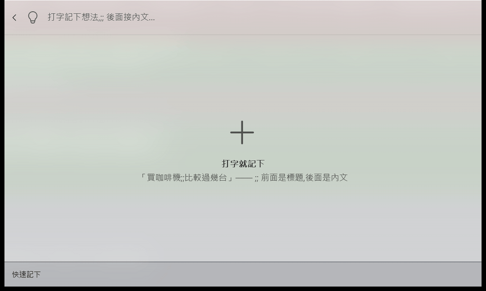

<p align="center">
  
</p>
<h1 align="center">Inkling</h1>
<p align="center">叫出 PowerToys Command Palette、打字、按 Enter —— 想法就存成資料夾裡的一個 Markdown 檔。</p>
<p align="center">
  <a href="https://github.com/1morr/Inkling/actions/workflows/ci.yml"></a>
  <a href="LICENSE"></a>
</p>
<p align="center"><a href="README.md">English</a> · <b>繁體中文</b></p>

<!-- 這一份與 README.md 是同一份文檔的兩個語言版本,改一份就要改另一份
     (結構、章節、表格的列都要對得上)。

     對外的 elevator pitch 以 README.md 的英文為準,但**沒有任何一處是照抄的**:
     同一件事要在三個長度不同的欄位裡講,各自被裁過,句子刻意不一樣 ——

       1. README.md 頂部那一句(一行,破折號,放得下「Markdown 檔」);
       2. docs/gallery/extension.json 的 shortDescription(兩短句,要能在 gallery
          的卡片上獨立成立);
       3. Package.appxmanifest 的 uap:VisualElements/@Description(最短;Windows 的
          應用程式清單會顯示它,所以必須經得起被截斷)。

     改的是「產品宣稱什麼」就三處一起動;只是換個說法,其他兩處可以不動。

     頂部的圖示直接引用 assets/gallery/icon.png —— 它是 render-icons.ps1 的產出,
     改 SVG 重跑腳本這裡就跟著更新,不要另外放一份。 -->

不離開鍵盤,幾秒鐘記下一個想法。同步、手機端存取與編輯交給你已經在用的雲端硬碟與編輯器;
Inkling 自己沒有一行同步程式碼。


<!-- 截圖用 tools\cmdpal-ui.ps1 的 shot 動作在真機上拍(PrintWindow,見該腳本與
     .claude/skills/verify-cmdpal-ui)。改了圖示、命令標題或版面就要重拍;
     拍之前先把筆記資料夾指到一個 demo 資料夾,別把真的筆記放進公開 repo。
     GIF 是同一個腳本連拍幾張再用 ffmpeg 合成的,流程寫在 docs/development.md。 -->

介面語言跟著 Windows 的顯示語言走(英文、繁體中文、簡體中文);**這裡的截圖是在英文系統上拍的** ——
兩份 README 共用同一組圖,而截圖裡有一半的字串(「Results」、底部那排按鈕)是 CmdPal 自己的,
跟著系統語言走、我們改不了。

## 需求

| | |
|---|---|
| Windows | 10.0.19041 以上 |
| Command Palette | 0.11 以上(獨立 MSIX 套件 `Microsoft.CommandPalette`) |

**不需要裝 .NET** —— 發佈的套件是 self-contained。

## 安裝

**還沒有發佈安裝包。** 目前沒有 GitHub Release、沒上 WinGet,也還沒進 Microsoft Store ——
套件身分與簽章還在定案(見 [docs/release-checklist.md](docs/release-checklist.md))。

**順序是簽章決定的**:沒簽章的 MSIX Windows 不讓側載。所以先走 Store —— 它會代簽,
而那份簽好的套件才餵得動後面兩條路。開通一條,這一節就補上那一條的安裝方式:

1. **Microsoft Store**,再從那裡進 CmdPal Extension Gallery(gallery 必填一個
   Store 或 WinGet 的 id)。
2. **WinGet** —— `winget install <id>`,指向那份簽好的套件;它帶
   `windows-commandpalette-extension` tag,之後在 Command Palette 裡直接搜也找得到。
3. **GitHub Releases** —— release workflow 每推一個 `v*` tag 就會產出 `.msixbundle`,
   但**在拿到憑證之前那些資產是未簽章的**:它們是拿去 Store 送審用的,不能側載。

現在要用的話從原始碼建:[開發與部署](docs/development.md),`tools\deploy.ps1` 一條指令部署到本機。

## 上手

裝好之後**先設一個 alias**,不然快速記下要從主搜尋框一路捲下去找:
CmdPal 設定 → Extensions → Inkling → `Inkling：快速記下` → Alias 填 `!`。

> **挑標點而不是字母**:字母會跟真實搜尋撞(想搜 `n` 開頭的東西就誤觸),標點不會。
> 想更快就再給它一個全域快速鍵,連 `!` 都省了。清單頁與新增筆記同樣可以設
> (最上面那張圖右側的 `#` 與 `@` 就是)。

然後:叫出 Command Palette → 打 `!` 加一個空白 → 快速記下頁跳出來 →
打 `買咖啡機的想法` → Enter。存檔完成,全程不離開鍵盤。



## 功能

| | |
|---|---|
| 快速記下 | 打字直接存檔;想連內文一起記就 `<標題>;;<內文>`(分隔符可換)。底下會列出標題相近的既有筆記,免得同一件事記兩遍。要貼多行內容時會多給一列「內文取自剪貼簿」,繞過單行搜尋框([為什麼](docs/design-notes.md#paste-multiline)) |
| 記下後先看一眼 | 存好會停在筆記上,確認沒記錯再按一次 Enter 收起 —— 收起那一下跳「已記下：標題」,跟關掉這個開關時是同一句話。預設開著,設定裡可以關掉 |
| 新增(完整) | `Inkling：新增筆記` 開表單,可寫多行內文;在清單頁按 `Ctrl+N` 也能直接開 |
| 瀏覽與搜尋 | 標題與內文都能搜,多個關鍵字是 AND,標題命中排前面;副標是內文的第一行摘要。搜不到時會直說「找不到符合的筆記」,按 Enter 直接進快速記下([空白提示有兩種](docs/design-notes.md#empty-content)) |
| Markdown 預覽 | 選中筆記按 Enter 看渲染結果。**隨手打的單一換行會照樣顯示成換行**,而磁碟上的 `.md` 一個字都不變([為什麼](docs/design-notes.md#preview-line-breaks)) |
| 原始文字 | `Ctrl+U` 在渲染結果與原文之間切換,**狀態全域共用而且記得住**。貼進來的 HTML / SVG 渲染完會整段消失,這個模式看得到([細節](docs/design-notes.md#source-mode)) |
| 編輯 | 表單式編輯(`Ctrl+E`),Tab 到「儲存」按 Enter;或用「在預設編輯器開啟」(`Ctrl+O`)跳出去改 |
| 複製內文 / 開啟檔案位置 | `Ctrl+Shift+C` 複製內文(不含 front matter,**面板不會關掉** —— [為什麼這件事重要](docs/design-notes.md#copy-feedback));`Ctrl+L` 在檔案總管裡選中那個 `.md` |
| 跳出去之後 | `Ctrl+O` 與 `Ctrl+L` 跳到外部程式之後,面板只是讓開 —— 熱鍵叫回來**還停在原本那一頁**([為什麼](docs/design-notes.md#open-external-return))。**編輯表單與隨手草稿這兩頁是例外**,它們會把面板收起來:那兩頁畫面上有一份你還能按儲存的副本,留著就可能蓋掉你剛跳出去改的東西。檔案被改名、移走,或 `.md` 根本沒有預設程式時,會在底部說明原因,[不會靜靜地什麼都不做](docs/design-notes.md#open-external-silent) |
| 隨手草稿 | `Inkling：隨手草稿` 開一塊永久的便條紙,打開就是上次留下的東西,不必取標題。**沒有自動儲存**(CmdPal 做不到,[為什麼](docs/design-notes.md#scratchpad-no-autosave)):`Tab` → `Enter` 存檔,**跳一句「已存到隨手草稿」再自己收起面板**(捨棄變更也會說一聲);`Ctrl+O` 跳到系統預設編輯器,自動儲存在那邊 |
| 刪除 | 清單頁 `Ctrl+D`,確認後**移到資源回收筒**。網路磁碟、或沒有資源回收筒的裝置上,Windows 會直接永久刪除 —— 確認框會講明白 |
| 連續刪 / 清空 | `Inkling：刪除筆記` 開一頁,`Enter` 刪除(先問一次)、`Ctrl+Enter` 直接刪;同一頁的「刪除全部」會先列出會刪掉哪些檔案。不是 Inkling 建立的檔案兩條路都會問([這兩個鍵為什麼這樣配](docs/design-notes.md#delete-keys)) |
| 介面語言 | 英文、繁體中文、簡體中文,跟著 Windows 的顯示語言走,[沒有設定項](docs/design-notes.md#ui-language) |

封存、tag 分類、置頂還沒做。`tags` 欄位讀得懂,但沒有值就不會寫進檔案。


## 快速鍵

清單頁與預覽頁上,選中一則筆記之後:

| 鍵 | 做什麼 | 清單頁 | 預覽頁 |
|---|---|:-:|:-:|
| `Ctrl+E` | 編輯(表單) | ✅ | ✅ |
| `Ctrl+N` | 新增筆記(開表單) | ✅ | — |
| `Ctrl+U` | 切換渲染結果 / 原始文字(全域,記得住) | ✅ | ✅ |
| `Ctrl+Shift+C` | 複製內文 | ✅ | ✅ |
| `Ctrl+O` | 用系統預設的程式開啟 `.md` | ✅ | ✅ |
| `Ctrl+L` | 在檔案總管裡選中這個檔案 | ✅ | ✅ |
| `Ctrl+D` | 刪除(先跳確認框) | ✅ | — |
| `Ctrl+K` | 打開選單,上面每一項都寫著自己的鍵 | ✅ | ✅ |

**`Enter` 與 `Ctrl+Enter` 是「位置鍵」,不是綁在命令上的**:它們按的是底部工具列固定的兩顆按鈕,
坐上去的是誰只看命令排序,所以每一頁的 `Enter` 給的是那條動線上真正的下一步:

| 頁面 | `Enter` | `Ctrl+Enter` |
|---|---|---|
| 清單頁 | 預覽 | 編輯 |
| 預覽頁 | 編輯 | 完成(收起面板) |
| 記下並預覽(快速記下的 Enter 落點) | 完成(收起面板) | 編輯 |
| `Inkling：刪除筆記` | 刪除(先問一次) | 直接刪 |
| 隨手草稿 | 捨棄變更(焦點在文字框裡時 `Enter` 是換行,要先 `Tab` 出來)| 在預設編輯器開啟 |

隨手草稿的**存檔是 `Tab` 到「儲存」再按 `Enter`**,存完面板自己收起來;收起時會跳一句話說明剛才做了什麼,
因為面板消失本身分不出「存好了」跟「沒存」。預覽頁與記下並預覽頁的兩個鍵為什麼**刻意相反**,
見[設計考證〈兩個位置鍵〉](docs/design-notes.md#secondary-command)。

**只有複製帶 Shift**:`Ctrl+C` 是搜尋框自己的複製鍵。哪些字母不能碰、為什麼刪除是 `Ctrl+D`,
見[設計考證〈清單頁的快速鍵〉](docs/design-notes.md#list-shortcuts)。
**CmdPal 目前不讓使用者改擴展的快速鍵**,能改的只有頂層命令的 alias 與全域快速鍵。

## 筆記檔長什麼樣

```markdown
---
id: 20260810-143052-a7f3
title: 買咖啡機的想法
created: 2026-08-10T14:30:52+08:00
updated: 2026-08-11T09:15:00+08:00
---

先查一下手沖跟義式的差別。
```

資料格式是承諾,幾個刻意的決定:

- **`id` 才是身分,檔名只是給人看的。** 改標題不會重新命名檔案 —— 在雲端同步資料夾裡
  頻繁 rename 是產生重複檔與衝突檔的頭號原因。
- **不認得的 front matter 欄位原樣保留。** 你用 Obsidian 之類的工具加的 `aliases`、
  `cssclass`,經過 Inkling 編輯一輪之後不會被吃掉。空的 `tags` 則不寫進檔案。
- **沒有 front matter 的 `.md` 照樣會出現在清單裡**,標題取內文的第一行有效文字、
  時間取檔案時間戳。你可以直接把既有的筆記資料夾指給 Inkling。
  這種檔案身上有記號(`Note.IsExternal`):日常瀏覽一視同仁,只有刪除相關的路會分開處理
  ([為什麼](docs/design-notes.md#delete-page))。
- 會掃子資料夾,新筆記一律寫在根目錄。
- **隨手草稿是同一個資料夾根目錄下的 `scratchpad.md`**,純文字、沒有 front matter,
  所以別的編輯器打開就是你寫的字。它**不會出現在清單與搜尋裡**,但**只有最上層那一個**
  —— 子資料夾裡剛好也叫 `scratchpad.md` 的檔案照樣是一則筆記。
  換筆記資料夾時舊草稿留在原地不搬,換回去就還在。

## 設定

在主搜尋框選中 **Inkling** 那一列按 `Ctrl+K` → 設定(`Ctrl+Enter` 直接到),
或 CmdPal 設定 → Extensions → Inkling。

| 設定 | 預設 | 說明 |
|---|---|---|
| 筆記資料夾 | `%OneDrive%\Inkling` | 只接受**完整路徑**(相對路徑會整筆拒絕);指向還不存在的資料夾會當場提示,第一次存檔時建立。旁邊的「瀏覽…」開系統的選資料夾對話框,選好就直接存 |
| 快速記下的分隔符 | `;;` | 前面是標題、後面是內文。長度不限,半形全形算同一個,清空就回到 `;;`。改完當下開著的快速記下頁就會跟上,不必 Reload |
| 記下後先看一眼 | 開啟 | Enter 記下並停在筆記上,再按一次才收起;關掉就是記完直接收起 |

表單上只有這三項。`settings.json` 裡還有第四個鍵 `Inkling.ShowSource`(原始文字模式),
那是 `Ctrl+U` 自己寫回去的檢視狀態,刻意不放進表單 —— 切換鍵就是它的介面。
設定檔的位置、格式與「更新擴展之後還在嗎」見[開發與部署](docs/development.md#settings-file)。

## 同步

Inkling **不做同步**。它只是把 Markdown 檔寫進你指定的資料夾,同步 100% 交給雲端硬碟客戶端
—— 離線可用性、衝突處理、手機端存取全部沿用 OneDrive / Dropbox 既有的能力。要在手機上看,
裝 OneDrive App 就行;也可以讓 Obsidian 之類的工具指向同一個資料夾。

**OneDrive 使用者**:把 Inkling 資料夾設成「一律保留在此裝置上」(資料夾按右鍵)——
開啟「檔案隨選」而檔案只有雲端佔位符時,讀取會觸發下載,搜尋就會卡住。多台機器同時編輯
同一則筆記時,OneDrive 會產生 `檔名-電腦名.md` 這種副本;資料不會遺失,副本照樣出現在
清單裡,自己決定留哪份。

## 遇到問題

**改了設定卻沒反應** — 先把設定頁關掉重開。那個頁面綁在某一個擴展實例上,中間發生過
Reload 或重新部署的話,按 Save 會靜靜地什麼都不做。

**搜尋結果裡多出一列 Inkling,按 Enter 沒反應** — 那是 Windows 的應用程式清單項被 CmdPal
內建的應用程式搜尋列了進來,不是重複的擴展 —— **只有從「套件還會登記到開始功能表」那個
版本升上來才會遇到**。套件的 exe 是純 COM server,「啟動」它本來就不會有任何事發生;
重新安裝一次就沒了。

**介面不是預期的語言** — 語言跟著 Windows 的**顯示語言**走(不是「地區格式」那個設定),
沒有設定項。剛改完顯示語言要重新登入才生效。

其餘(部署、註冊、trimming、擴展自己的診斷 log)見
[開發與部署 → 排錯](docs/development.md#troubleshooting)。

## 文檔

<!-- README.md 這一節多一句「The in-depth docs are written in Traditional Chinese.」,
     對中文讀者是廢話,所以刻意不對應 —— 兩份 README 唯一容許不對齊的地方,別「補齊」。 -->

| | |
|---|---|
| [docs/development.md](docs/development.md) | 建置、部署、專案結構、排錯 |
| [docs/design-notes.md](docs/design-notes.md) | 「為什麼是這樣」的完整考證(快速記下為什麼是頁面不是 fallback、toast 為什麼一個都不能發、確認框的按鈕為什麼沒有顏色……),對象是維護者與其他 CmdPal 擴展作者 |
| [CHANGELOG.md](CHANGELOG.md) | 版本紀錄 |
| [CONTRIBUTING.md](CONTRIBUTING.md) | 動手改這個 repo 之前先讀 |

## 參與貢獻

歡迎回報 bug 與提功能建議(用 GitHub 的 issue 範本)。要送 PR 請先讀
[CONTRIBUTING.md](CONTRIBUTING.md) —— 這個 repo 有幾條不算顯然的規矩
(介面字串三份 `.resx` 一起改、改了行為要同步更新兩份 README 與手動驗證清單)。

## 授權

[MIT](LICENSE)
